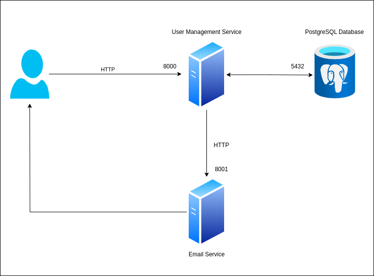
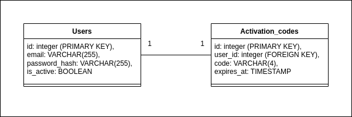

# Dailymotion - User Registration API

The User Registration API allows users to create accounts, receive verification codes via email, and activate their accounts using these codes. 

The API is built in Python and  FastAPI, with PostgreSQL as the database.

## Architecture

The User Registration API is composed of 3 components

**User Management Service**: used to manage registartion and email activation.

**Email Service (third party service)**: used to send activation codes to users via email.

**PostgreSQL**: used to store user's data and activation codes.






## Requirements

**Docker**

**Docker compose**

## instructions

To set up the use User Registration API

1. **Clone the repository:**

```bash
   git clone git@github.com:housseinnajahi/dailymotion.git
   cd dailymotion
```

2. **Set up env variables for Email Service:**

For the Email service you can either use SMTP client to send emails or just log the activation code in the console.

To use SMTP, generate settings from an Email Delivery Platform like **mailtrap** and than setup the following env variables

```bash
    SMTP_SERVER: "live.smtp.mailtrap.io"
    SMTP_PORT: 587
    SMTP_USERNAME: "**************************"
    SMTP_PASSWORD: "**************************"
    SMTP_FROM: "hello@demomailtrap.com"
    USE_SMTP: True
```

Otherwise you can just set `USE_SMTP: False` in the docker compose file.

3. **Build and run containers:**

```bash
    docker compose up --build
```

3. **Create the test database:**

```bash
    docker exec -it dailymotion-postgres-db-1 psql -U dailymotion -c "CREATE DATABASE dailymotion_test;"
```

4. **Run the unit tests:**

```bash
    docker exec -it dailymotion-user-management-service-1 bash
    pytest tests/
```

## API Endpoints

### User Mangement Service

Link to documentation: http://localhost:8000/users/docs

1. **Register a User**

*Endpoint:* `POST /api/v1/users/register`

*Request Body*

```json
    {
        "email": "test@gmail.com",
        "password": "your_password"
    }
```

*Exmaple of cURL Request*

```bash
    curl -X POST http://localhost:8000/api/v1/users/register \
    -H "Content-Type: application/json" \
    -d '{"email": "test@gmail.com", "password": "your_password"}'
```

2. **Activate a User**

*Endpoint:* `POST /api/v1/users/activate`

*Basic Authentication:* Provide the user’s email and password as credentials.

*Request Body*

```json
    {
        "code": "1234"
    }
```

*Exmaple of cURL Request*

```bash
    curl -X POST http://localhost:8000/api/v1/users/activate \
    -H "Content-Type: application/json" \
    -u "test@gmail.com:your_password" \
    -d '{"code": "1234"}'
```

### User Mangement Service

Link to documentation: http://localhost:8001/emails/docs

2. **Send an Email**

*Endpoint:* `POST /api/v1/emails/send`

*Authentication using api key:* Provide the api key as credentials.

*Request Body*

```json
    {
        "email": "test@gmail.com",
        "code": "1234"
    }
```

*Exmaple of cURL Request*

```bash
    curl -X POST http://localhost:8001/api/v1/emails/send -H "x-api-key: bb9e5b1b-1740-4a67-ba88-3a6eb4b8e176" -H "Content-Type: application/json" -d '{
    "email": "test@gmail.com",
    "code": "1111"
    }'
```
